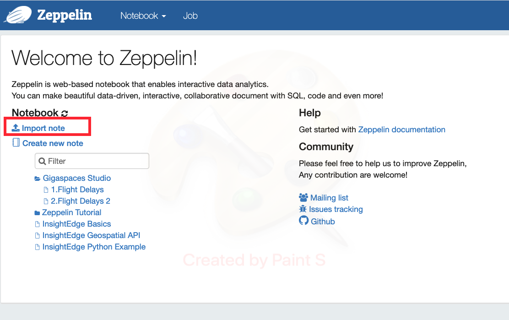
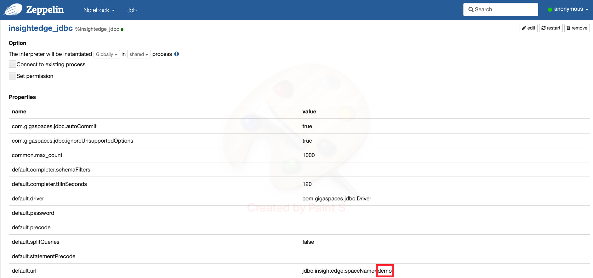
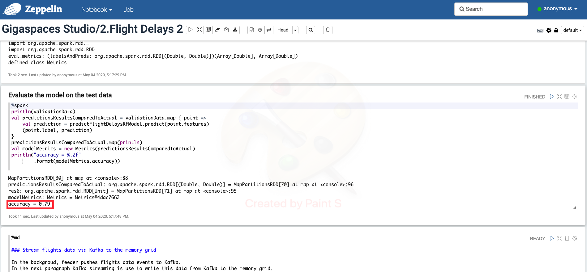
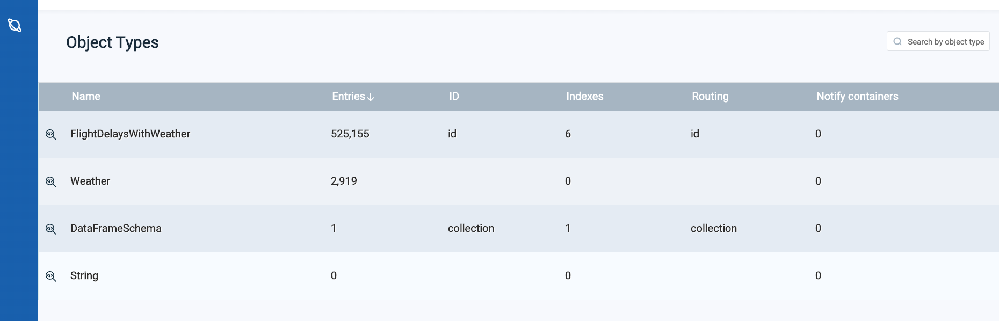
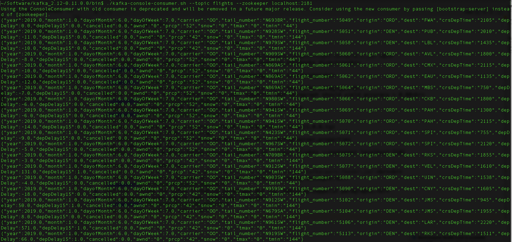
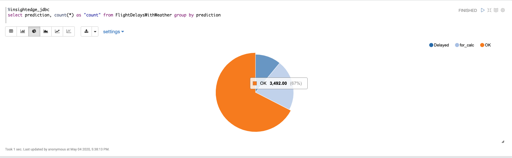

# FlightDelayML Lab 
## Lab-1: Deploy a machine learning pipeline
* load data , enrich , train the model and predict Participants will use various industry leading building blocks such as spark , kafka and in-memory processing

### In this lab you will:
#### 1. Create an InsightEdge cluster
#### 2. Deploy an application which consumes flight delay data to make binary predictions (yes/no) about which flights are likely to get delayed.

Please perform the following steps:

1. Run InsightEdge: 
   `./gs.sh host run-agent --auto`
2. Create 2g container (use the cli): 
   `container create --memory 2g localhost` 
3. Deploy flight_delay space 
   `pu deploy flights_space ~/FlightDelayML/flightDelaySpace/target/flight-delay-0.1.jar` 
4. Open zeppelin and import the two notebooks from zeppelin_notebooks directory 
    
5. Change space name to “flights_space” in insightedge_jdbc interpreter 
    
6. Run all zeppelin paragraphs (one by one) until you reach the Kafka paragraph. 
   Before continuing to the kafka section your zeppelin last paragraph should yield accuracy ~ 0.80 
    
   Flights_space should have the following number of records: 
    
7. Download and run kafka:
   * https://archive.apache.org/dist/kafka/0.11.0.0/kafka_2.12-0.11.0.0.tgz
   * tar zxvf kafka_2.12-0.11.0.0.tgz
   * ~/kafka_2.12-0.11.0.0/bin/kafka-server-start.sh ../config/server.properties 
   * In a new session run:
   ~/kafka_2.12-0.11.0.0/bin/kafka-console-consumer.sh --topic flights --zookeeper localhost:2181 
   
8. Deploy flights_feeder: 
   `pu deploy flights_feeder ~/FlightDelayML/kafkaFeederPU/target/kafka-pers-feeder.jar`  
9. In the kafka-console-consumer.sh session you should see coming messages: 
    
8. Continue running the kafka streaming paragraph and the remaining zeppelin paragraphs. 
9. Last paragraph view should look something like: 
     
10. You are done with the lab!!! 
    
    

