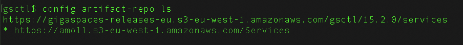

# PartnerWorkShop 
## Lab-3: Deploy a machine learning pipeline
* load data , enrich , train the model and predict Participants will use various industry leading building blocks such as spark , kafka and in-memory processing

### In this lab you will:
#### 1. Create an InsightEdge product gsctl cluster
#### 2. Deploy an application which consumes flight delay data to make binary predictions (yes/no) about which flights are likely to get delayed.

Before starting the lab please read [Managing the GigaSpaces Product Version](https://docs.gigaspaces.com/latest/orchestration/gsctl-manage-product-version.html) 

Please perform the following steps:

1. Create InsightEdge product gsctl cluster 
    
2. Change artifact-repo to https://amoll.s3-eu-west-1.amazonaws.com/Services 
    
3. Deploy flight_delay space 
   `deploy --type=stateful --memory=2048 flights_space flight-delay-0.1.jar` 
4. Open zeppelin and import the two notebooks from zeppelin_notebooks directory 
    
5. Change space name to “flights_space” in insightedge_jdbc interpreter 
    
6. Run all zeppelin paragraphs (one by one) until you reach the Kafka paragraph. 
   Before continuing to the kafka section your zeppelin last paragraph should yield accuracy = 0.79 
    
   Flights_space should have the following number of records: 
    
7. Deploy flights_feeder: 
   `deploy --type=stateless --property=feeder.flights.path=/home/ec2-user/data.csv --property=kafka.bootstrapServer=kafka-0.service.consul:9092 flights_feeder kafka-pers-feeder.jar`  
8. Continue running the kafka streaming paragraph and the remaining zeppelin paragraphs. 
9. Last paragraph view should look something like: 
     
10. You are done with the lab!!! 
    Once you finish reviewing your work **Don't forget to teardown the cluster**.
    

